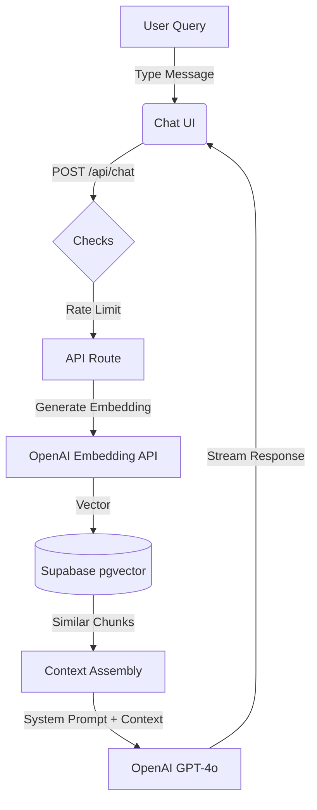

# GOTI - Generative Orchestrator of Technological Innovation

An AI assistant powered by OpenAI GPT-4 with RAG (Retrieval-Augmented Generation) capabilities, designed to help with vibecoding projects by providing context-aware responses from a knowledge base of tool documentation and changelogs.

## Features

### Core Functionality
- 🤖 **AI Chat Interface**: Real-time streaming chat powered by OpenAI GPT-4o
- 📚 **RAG System**: Semantic search over documentation using vector embeddings
- 💾 **Persistent Storage**: Chat history and documents stored in Supabase
- 📊 **Real Metrics Dashboard**: Live tracking of conversations, lines of code generated, and bugs found
- 🎨 **Enhanced Styling**: Beautiful markdown rendering with syntax highlighting and copy functionality
- 📱 **Mobile Responsive**: Native-app like experience on iOS and Android

### Knowledge Base Coverage
GOTI maintains up-to-date knowledge of:
- **Lovable** - AI-powered full-stack development platform
- **Zapier** - Workflow automation
- **Activepieces** - Open-source automation
- **Maker** - No-code platform
- **Replit** - Cloud development environment
- **Bubble** - Visual programming platform
- **Base44** - AI app builder

## Tech Stack

- **Frontend**: Next.js 16 (App Router), React, TypeScript
- **AI**: OpenAI GPT-4o, Vercel AI SDK
- **Database**: Supabase (PostgreSQL + pgvector)
- **RAG**: LangChain for document processing and embeddings
- **Styling**: Tailwind CSS, Shadcn/UI, Phosphor Icons
- **Deployment**: Vercel

## Prerequisites

- Node.js 18+ and npm
- Supabase account and project
- OpenAI API key

## Setup

### 1. Install Dependencies

```bash
npm install
```

### 2. Environment Variables

Create a `.env.local` file in the root directory:

```env
# Required - OpenAI API Configuration
OPENAI_API_KEY=your_openai_api_key_here

# Required - Supabase Configuration
NEXT_PUBLIC_SUPABASE_URL=your_supabase_project_url
NEXT_PUBLIC_SUPABASE_ANON_KEY=your_supabase_anon_key

# Optional - For future integrations (not currently used)
# TRELLO_API_KEY=your_trello_api_key
# TRELLO_TOKEN=your_trello_token
```

**Security Notes**:
- The `NEXT_PUBLIC_` prefix exposes variables to the client-side
- The Supabase anon key is safe to expose as it's protected by Row Level Security (RLS) policies
- Never commit `.env.local` to version control (it's in `.gitignore`)
- For production, use environment variables in your hosting platform (Vercel, etc.)

### 3. Database Setup

1. Go to your [Supabase Dashboard](https://supabase.com/dashboard)
2. Navigate to **SQL Editor**
3. Run the entire contents of `supabase/schema.sql`

This will:
- Enable the pgvector extension
- Create `chats`, `messages`, `documents`, and `document_chunks` tables
- Set up the `match_document_chunks` function for vector similarity search
- Configure Row Level Security policies

### 4. Run Development Server

```bash
npm run dev
```

Open [http://localhost:3000](http://localhost:3000) to see the application.

## Usage

### Chat Interface

Simply type your questions in the chat interface. GOTI will:
1. Search the knowledge base for relevant context
2. Use retrieved information to provide accurate answers
3. Cite sources when using knowledge base content

### Uploading Documents
GOTI supports uploading documents (PDF, JSON, Markdown, Text) directly via the Chat UI or API. These documents are indexed into the Knowledge Base (RAG) for future context.

**Via Chat UI:**
- Click the Paperclip icon
- Or **Paste (Ctrl+V)** a file directly into the chat input
- Or **Drag & Drop** a file


```javascript
fetch('/api/documents/upload', {
    method: 'POST',
    headers: { 'Content-Type': 'application/json' },
    body: JSON.stringify({
        title: "Document Title",
        source: "Source Name (e.g., Lovable)",
        content: "Your markdown content here..."
    })
}).then(r => r.json()).then(console.log);
```

**Via API:**
```bash
curl -X POST http://localhost:3000/api/documents/upload \
  -H "Content-Type: application/json" \
  -d '{
    "title": "Document Title",
    "content": "Your content...",
    "source": "Source Name"
  }'
```

### Managing Documents

- **List documents**: `GET /api/documents/list`
- **Delete document**: `DELETE /api/documents/delete?id=documentId`
- **Health check**: `GET /api/health`

## Project Structure

```
goti/
├── app/
│   ├── api/
│   │   ├── chat/route.ts          # Chat API with RAG integration
│   │   ├── documents/
│   │   │   ├── upload/route.ts    # JSON document upload
│   │   │   ├── upload-file/route.ts # File (PDF, JSON, MD) upload & parsing
│   │   │   ├── list/route.ts      # List all documents
│   │   │   └── delete/route.ts    # Delete documents
│   │   └── health/route.ts        # System health check
│   ├── components/
│   │   └── chat.tsx               # Chat UI component
│   └── page.tsx                   # Main page
├── lib/
│   ├── supabase.ts                # Supabase client
│   ├── embeddings.ts              # OpenAI embeddings utilities
│   ├── document-processing.ts     # Text chunking & processing
│   ├── vector-search.ts           # Semantic search functions
│   └── metrics-service.ts         # Analytics & usage tracking
├── supabase/
│   └── schema.sql                 # Database schema with pgvector
└── docs/
    ├── changelog-sources.md       # Documentation sources reference
    └── sample-documents/          # Sample documents for testing
```

## How RAG Works

## How RAG Works



1. **Document Upload**: Documents are split into chunks using `RecursiveCharacterTextSplitter`.
2. **Embedding Generation**: Each chunk is converted to a 1536-dimensional vector.
3. **Storage**: Chunks and embeddings are stored in Supabase.
4. **Retrieval**: User queries trigger detailed vector similarity search.
5. **Generation**: GPT-4o synthesizes the answer using the retrieved context.

## Development

### Key Files to Know

- `app/api/chat/route.ts` - Main chat logic with RAG retrieval
- `lib/vector-search.ts` - Semantic search implementation
- `lib/document-processing.ts` - Document chunking strategy
- `supabase/schema.sql` - Complete database schema

### Adding New Tools

1. Add the tool's changelog URL to `docs/changelog-sources.md`
2. Scrape or copy the changelog content
3. Upload via the `/api/documents/upload` endpoint
4. GOTI will automatically use it for relevant queries

## Troubleshooting

### Build Errors with LangChain

If you see module resolution errors:
```bash
npm install @langchain/core @langchain/textsplitters --legacy-peer-deps
```

### Database Connection Issues

Verify your Supabase credentials in `.env.local` and ensure the schema has been run.

### RAG Not Working

1. Check `/api/health` to verify tables are accessible
2. Ensure documents have been uploaded successfully
3. Check browser console for any API errors

## Deployment

### Vercel (Production)

1. **Push to GitHub**: Ensure your code is in a GitHub repository.
2. **Import in Vercel**: Create a new project and import your repository.
3. **Environment Variables**: Add the following in Vercel Project Settings:
   - `NEXT_PUBLIC_SUPABASE_URL`
   - `NEXT_PUBLIC_SUPABASE_ANON_KEY`
   - `OPENAI_API_KEY`
4. **Deploy**: Vercel will automatically build and deploy your app.

### Mobile Installation

- **iOS**: Open in Safari -> Share -> Add to Home Screen
- **Android**: Open in Chrome -> Menu -> Add to Home Screen

## Roadmap: AI Consultancy Evolution

To transform GOTI into a key ally for your AI Consultancy, Education, and Development business, we propose the following evolutionary phases:

### Phase 1: Knowledge Expansion & Automation (The "Brain") 🧠
*Focus: Increasing the depth and freshness of technical knowledge.*
- [ ] **Automated Changelog Scraping**: Implement n8n workflows to daily scrape and update documentation for tracked tools.
- [x] **Multi-Modal Input**: Allow users to upload screenshots of UI/code for analysis (using GPT-4o Vision).
- [ ] **Expanded Knowledge Base**: Add architectural patterns, system design docs, and "Vibecoding" best practices.
- [x] **Voice Interface**: Enable voice-to-text for "walking and talking" coding sessions.

### Phase 2: Client & Project Management (The "Business") 💼
*Focus: Managing multiple clients and projects efficiently.*
- [ ] **Multi-Tenant Support**: Separate chat history and knowledge bases per client/project.
- [ ] **Context Injection**: Upload specific client requirements or brand guidelines to guide AI responses.
- [ ] **Automated Reporting**: Generate weekly summaries of development progress, bugs fixed, and features built.
- [ ] **Consultancy Dashboard**: Admin view to see usage stats across all client projects.

### Phase 3: Advanced Agentic Capabilities (The "Workforce") 🤖
*Focus: Moving from "Assistant" to "Agent" that performs tasks.*
- [ ] **Code Generation Agents**: Allow GOTI to write files directly to GitHub repositories via PRs.
- [ ] **Testing Agents**: Automatically generate and run test cases for generated code.
- [ ] **Deployment Agents**: Trigger deployments or infrastructure changes via natural language.
- [ ] **Tool Use**: Give GOTI access to linear/Jira to create tickets from chat.

### Phase 4: Enterprise Integration & Scale (The "Empire") 🏢
*Focus: Scaling the operation for a larger team.*
- [ ] **SSO & RBAC**: Enterprise-grade authentication and role-based access control.
- [ ] **Team Collaboration**: Shared chat sessions where multiple developers + AI can collaborate.
- [ ] **Analytics & ROI**: Advanced dashboards showing time saved and value generated for clients.
- [ ] **White-Labeling**: Ability to deploy branded versions of GOTI for specific enterprise clients.

## License

MIT

## Contributing

This is a personal project for vibecoding assistance. Feel free to fork and adapt for your needs!
